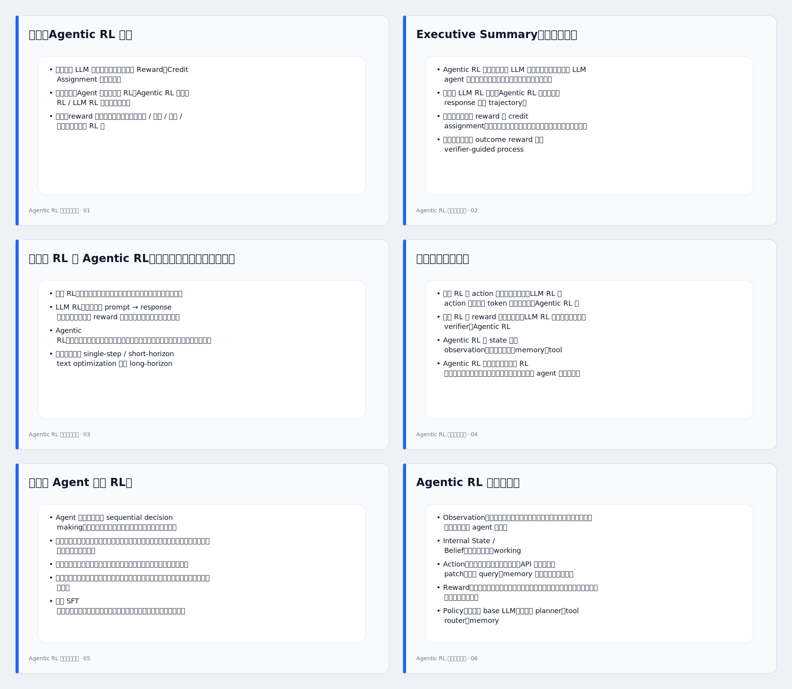

# Agentic RL 中文调研报告

想快速看 PPT 大概长什么样，先看下面这个 6 页预览图；完整 30 页预览在 `reports/agentic_rl_survey_cn_preview.svg` 和 `reports/agentic_rl_survey_cn_preview.html`。



## 如何得到可打开的 PPTX

因为当前 PR / diff 流程不支持直接提交二进制 `.pptx`，仓库里提交的是文本安全的 Base64：

```bash
python3 tools/decode_agentic_rl_pptx.py
```

运行后会在仓库根目录得到：

```text
agentic_rl_survey_cn.pptx
```

也可以从 Markdown 源稿重新生成：

```bash
python3 tools/build_agentic_rl_pptx.py
```
